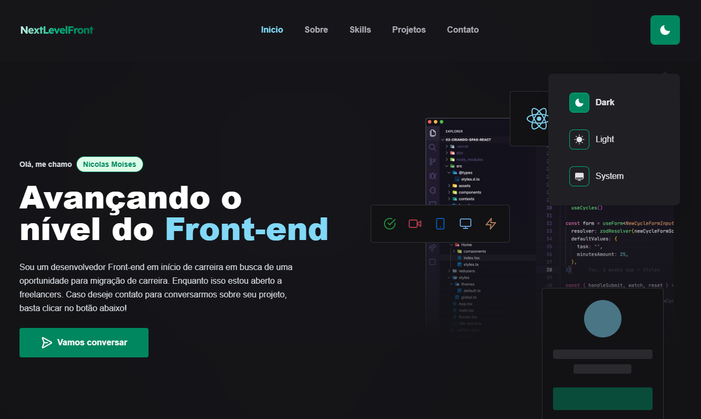

  

## 💻 Projeto

Aplicação relacionad ao meu portfólio.

## ✨ Tecnologia

- [TypeScript](https://www.typescriptlang.org/)
- [React](https://reactjs.org/)
- E muitas outras…

## 🚀 Como executar

Ao acessar a pasta, é preciso baixar os pacotes com o gerenciador de sua preferencia.

## 🔖 Layout

O layout foi criado por mim no Figma e repassado para o código

## 📝 License

Esse projeto está sob a licença MIT. Veja o arquivo [LICENSE](LICENSE) para mais detalhes.

---

  Feito com 💜 by Nicolas

